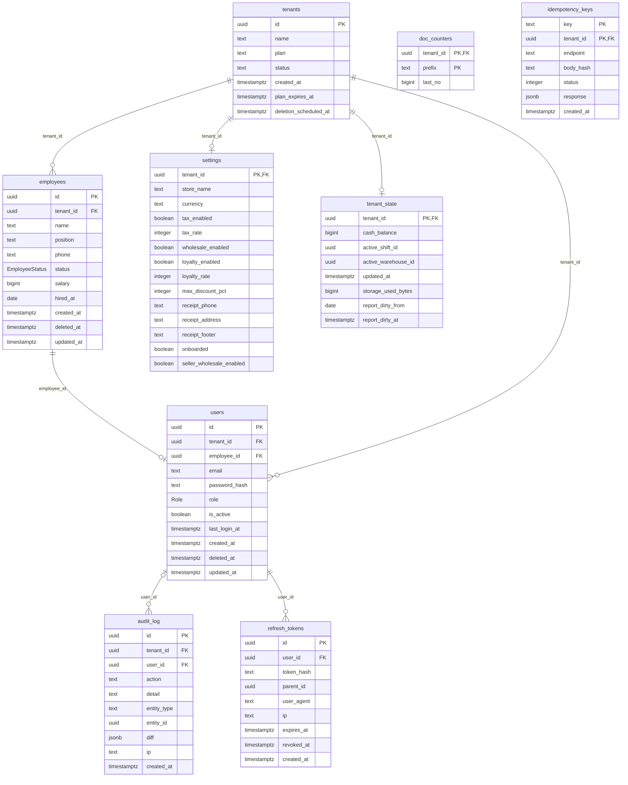
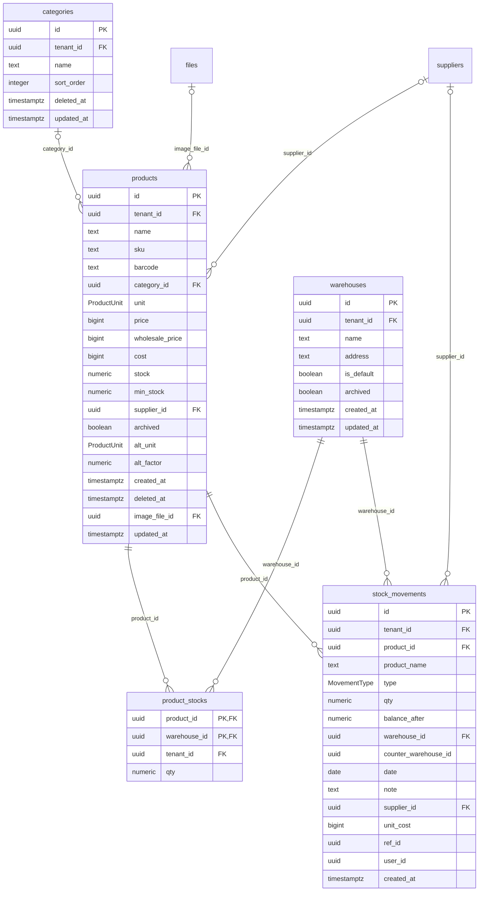
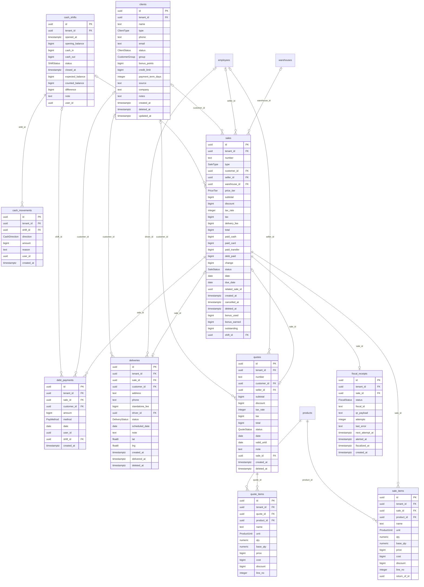
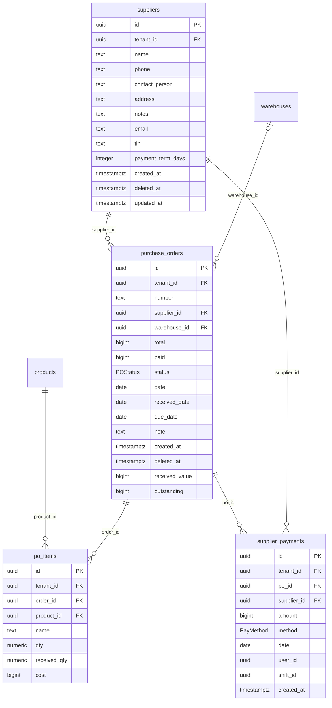
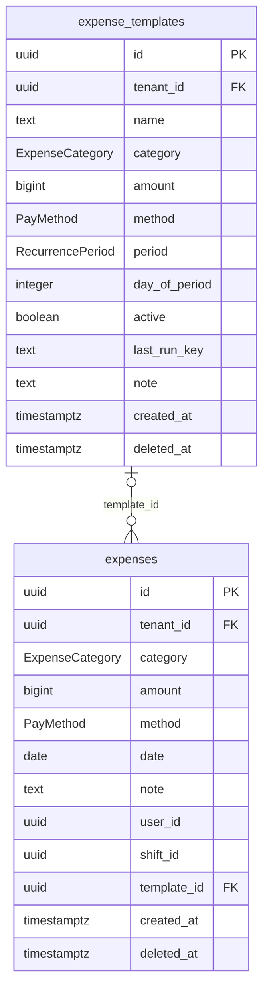
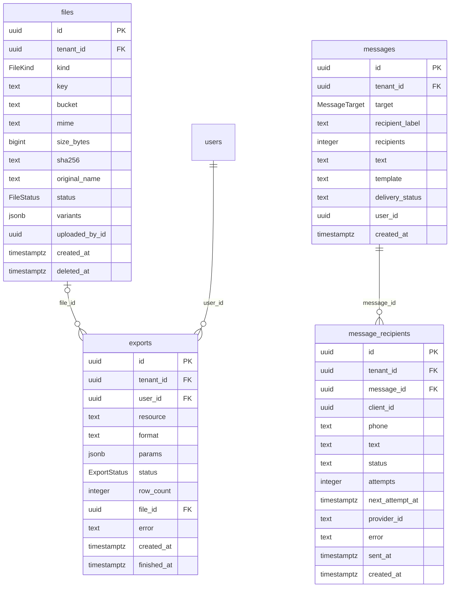
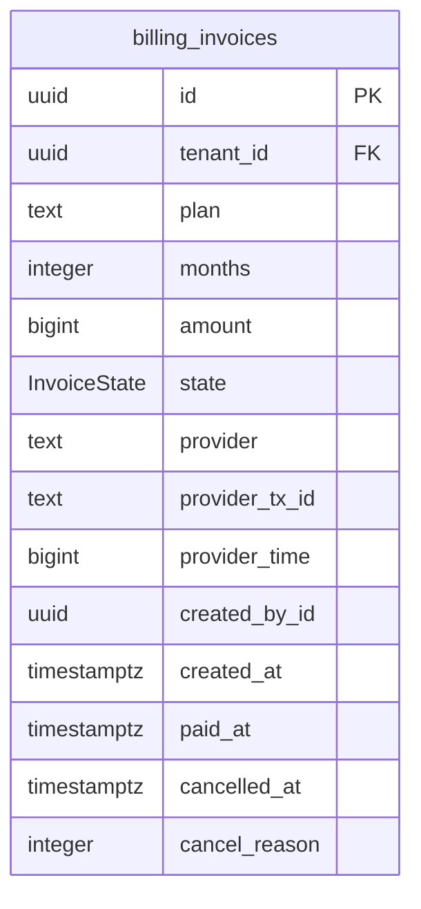
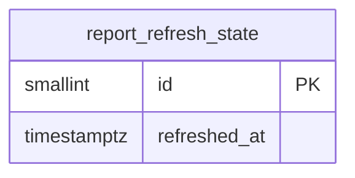

# Ma’lumotlar bazasi — tuzilma va jadvallar

> Generatsiya qilingan: `npm run docs:db` (`scripts/db-docs/`). Tuzilma — ishlab turgan bazadan (migratsiyalar qo‘llangan), ustun izohlari — `apps/api/prisma/schema.prisma`, jadvallar vazifasi — `scripts/db-docs/tables.py`. Bu faylni qo‘lda tahrirlamang.

PostgreSQL 16 · 37 jadval · 7 ko‘rinish · 24 enum. Diagrammalar — [Mermaid](https://mermaid.js.org) (GitHub va VS Code o‘zi chizadi). DBeaver’da ham: `public` sxemasi → **View Diagram**.

## Umumiy qoidalar

- **Do‘kon (tenant) ajratilishi.** Deyarli har jadvalda `tenant_id`; Row Level Security (FORCE) ilova roliga (`crm_app`) faqat joriy do‘kon qatorlarini ko‘rsatadi. Bog‘lanishlar `(tenant_id, x_id) → (tenant_id, id)` ko‘rinishida — bir do‘kon yozuvi boshqasinikiga bog‘lana olmaydi. RLS’siz: `tenants`, `refresh_tokens`, `report_refresh_state`, `_prisma_migrations`.
- **Kalitlar** — UUID (v7, vaqt bo‘yicha tartiblangan), ilova yaratadi.
- **Pul** — `bigint`, butun so‘m. **Miqdor** — `numeric`, 3 kasr xonagacha.
- **Yumshoq o‘chirish** — `deleted_at` to‘lsa yozuv yashiriladi, lekin saqlanadi (tiklash mumkin). Omborlar va mahsulotlar — `archived`.
- **Versiya** — `updated_at`: tahrirda `If-Match` bilan bir vaqtdagi o‘zgarishlar to‘qnashuvi aniqlanadi.
- **Nusxa (snapshot)** — chek va hujjat qatorlarida nom, narx, tannarx sotuv paytidagicha saqlanadi.
- **Hisoblangan (denormalizatsiya) maydonlar** — `products.stock` (trigger), `tenant_state.cash_balance`, `purchase_orders.paid` va `received_value`, `sales.debt_paid`; `sales.outstanding` va `purchase_orders.outstanding` — GENERATED. Har kecha invariant tekshiruvi ularni noldan qayta hisoblab solishtiradi.
- **Faqat qo‘shiladigan jurnallar** — `audit_log`, `stock_movements`: UPDATE va DELETE trigger bilan taqiqlangan.
- **O‘chirish harakati** (bog‘lanishlarda): CASCADE — ota o‘chsa, bola ham o‘chadi; RESTRICT va NO ACTION — bola bor ekan, ota o‘chmaydi; SET NULL — havola bo‘shatiladi.
- **FK’siz havolalar** — `user_id` (kim qildi), `stock_movements.ref_id` (turli hujjat) va `counter_warehouse_id`, `sales.related_sale_id` (qaytarishdan asl chekka), `sale_items.return_of_id`, `message_recipients.client_id`: tarix buzilmasin (yozuv o‘chsa ham qoladi).

## Umumiy ko‘rinish

Faqat bog‘lanishlar (`tenants` ga bog‘lanish ko‘rsatilmagan — u hamma jadvalda bor). `||--o{` — bittaga ko‘p, `|o` — ota ixtiyoriy (havola bo‘sh bo‘lishi mumkin), `o|` — birga bir.

```mermaid
erDiagram
    cash_shifts ||--o{ cash_movements : "shift_id"
    cash_shifts |o--o{ debt_payments : "shift_id"
    cash_shifts |o--o{ sales : "shift_id"
    categories |o--o{ products : "category_id"
    clients |o--o{ debt_payments : "customer_id"
    clients |o--o{ deliveries : "customer_id"
    clients |o--o{ quotes : "customer_id"
    clients |o--o{ sales : "customer_id"
    employees |o--o{ deliveries : "driver_id"
    employees |o--o{ quotes : "seller_id"
    employees |o--o{ sales : "seller_id"
    employees ||--o| users : "employee_id"
    expense_templates |o--o{ expenses : "template_id"
    files |o--o{ exports : "file_id"
    files |o--o{ products : "image_file_id"
    messages ||--o{ message_recipients : "message_id"
    products ||--o{ po_items : "product_id"
    products ||--o{ product_stocks : "product_id"
    products ||--o{ quote_items : "product_id"
    products ||--o{ sale_items : "product_id"
    products ||--o{ stock_movements : "product_id"
    purchase_orders ||--o{ po_items : "order_id"
    purchase_orders ||--o{ supplier_payments : "po_id"
    quotes ||--o{ quote_items : "quote_id"
    sales ||--o{ debt_payments : "sale_id"
    sales |o--o| deliveries : "sale_id"
    sales ||--o| fiscal_receipts : "sale_id"
    sales |o--o| quotes : "sale_id"
    sales ||--o{ sale_items : "sale_id"
    suppliers |o--o{ products : "supplier_id"
    suppliers ||--o{ purchase_orders : "supplier_id"
    suppliers |o--o{ stock_movements : "supplier_id"
    suppliers ||--o{ supplier_payments : "supplier_id"
    users |o--o{ audit_log : "user_id"
    users ||--o{ exports : "user_id"
    users ||--o{ refresh_tokens : "user_id"
    warehouses ||--o{ product_stocks : "warehouse_id"
    warehouses |o--o{ purchase_orders : "warehouse_id"
    warehouses |o--o{ sales : "warehouse_id"
    warehouses ||--o{ stock_movements : "warehouse_id"
```

## Do'kon va kirish

Har bir do'kon (SaaS mijozi) — `tenants` dagi bitta qator. Boshqa barcha jadvallarda `tenant_id` bor va shu do'konga tegishli. Xodim — shaxs, foydalanuvchi — uning kirish hisobi.

### `tenants`

Do'kon — tizimdagi eng yuqori birlik; boshqa jadvallardagi `tenant_id` shunga ishora qiladi. Tarif (`plan`, `plan_expires_at`), holat (`active`; `suspended` — muddati o'tgan: o'qish bor, yozish yo'q; `deleting` — o'chirish so'ralgan, 30 kun muhlat) va o'chirish rejasi. RLS yo'q: login va ro'yxatdan o'tishda do'kon hali ma'lum emas.

| Ustun | Tur | Bo‘sh bo‘lishi mumkin | Izoh |
|-------|-----|----|------|
| `id` | uuid | — | **PK** · Yozuv identifikatori (UUID v7) |
| `name` | text | — | Nomi |
| `plan` | text | — | Tarif |
| `status` | text | — | active \| suspended (o'qish mumkin, yozish yo'q) \| deleting (30 kun muhlat) |
| `created_at` | timestamptz | — | Yaratilgan vaqt |
| `plan_expires_at` | timestamptz | ha | Pullik tarif amal qilish muddati — to'lov tasdiqlangach uzayadi (T-126) |
| `deletion_scheduled_at` | timestamptz | ha | O'chirish so'ralgan bo'lsa — shu vaqtdan keyin to'liq tozalanadi (T-127) |

### `tenant_state`

Do'konning tez o'zgaradigan joriy holati — bitta qator: kassadagi naqd (`cash_balance`), ochiq smena, joriy ombor, S3'da band hajm, hisobotning "eskirgan" belgisi. Sozlamalardan ataylab ajratilgan: sozlama keshlanadi, holat esa har sotuvda o'zgaradi.

- RLS: majburiy (FORCE)

| Ustun | Tur | Bo‘sh bo‘lishi mumkin | Izoh |
|-------|-----|----|------|
| `tenant_id` | uuid | — | **PK** · → `tenants` |
| `cash_balance` | bigint | — | Kassa yashig'idagi naqd — faqat ochiq smenada o'zgaradi (I9) |
| `active_shift_id` | uuid | ha | Hozir ochiq smena |
| `active_warehouse_id` | uuid | ha | Joriy (sukut) ombor |
| `updated_at` | timestamptz | — | Oxirgi o'zgarish vaqti — versiya (`If-Match`) |
| `storage_used_bytes` | bigint | — | S3 da band qilingan hajm (bayt). Yagona yozuvchi — FilesService (09 §9.5) |
| `report_dirty_from` | date | ha | Hisobot ko'rinishi shu kundan eskirgan (orqa sanali yozuv) — trigger yozadi, tungi yangilash tozalaydi |
| `report_dirty_at` | timestamptz | ha | Hisobot qachon eskirgan deb belgilangan |

### `settings`

Do'kon sozlamalari — bitta qator: nom, valyuta, QQS, ulgurji savdo (va sotuvchiga ulgurji), sodiqlik ballari, maksimal chegirma, chekdagi telefon, manzil va pastki matn, boshlang'ich sozlash tugaganmi.

- RLS: majburiy (FORCE)

| Ustun | Tur | Bo‘sh bo‘lishi mumkin | Izoh |
|-------|-----|----|------|
| `tenant_id` | uuid | — | **PK** · → `tenants` |
| `store_name` | text | — | Do'kon nomi (chekda) |
| `currency` | text | — | Valyuta |
| `tax_enabled` | boolean | — | QQS yoqilgan |
| `tax_rate` | integer | — | QQS foizi, butun son (12 = 12%) |
| `wholesale_enabled` | boolean | — | Ulgurji savdo yoqilgan |
| `loyalty_enabled` | boolean | — | Sodiqlik ballari yoqilgan |
| `loyalty_rate` | integer | — | Sotuvdan necha foiz ball beriladi |
| `max_discount_pct` | integer | — | Ruxsat etilgan maksimal chegirma (%) |
| `receipt_phone` | text | — | Chekdagi telefon |
| `receipt_address` | text | — | Chekdagi manzil |
| `receipt_footer` | text | — | Chek pastidagi matn |
| `onboarded` | boolean | — | Boshlang'ich sozlash tugagan |
| `seller_wholesale_enabled` | boolean | — | Sotuvchi ham ulgurji narxda sotadi va ulgurji narxni ko'radi (sukut — yo'q) |

### `employees`

Xodim — shaxs haqidagi yagona manba: ism, lavozim, telefon, maosh, holat. Kirish hisobi bo'lmasligi ham mumkin (masalan haydovchi). Hujjatlarda sotuvchi, mas'ul va haydovchi sifatida ishtirok etadi.

- RLS: majburiy (FORCE)

| Ustun | Tur | Bo‘sh bo‘lishi mumkin | Izoh |
|-------|-----|----|------|
| `id` | uuid | — | **PK** · Yozuv identifikatori (UUID v7) |
| `tenant_id` | uuid | — | → `tenants` |
| `name` | text | — | Nomi |
| `position` | text | — | Lavozim |
| `phone` | text | — | Telefon |
| `status` | `EmployeeStatus` (enum) | — | Holat (qiymatlari — Enumlar bo'limida) |
| `salary` | bigint | — | Maosh (so'm) |
| `hired_at` | date | — | Ishga olingan sana |
| `created_at` | timestamptz | — | Yaratilgan vaqt |
| `deleted_at` | timestamptz | ha | Yumshoq o'chirilgan vaqt; bo'sh — faol |
| `updated_at` | timestamptz | — | Versiya (If-Match, T-098): tahrirlanadigan maydon o'zgarganda yangilanadi |

### `users`

Tizimga kirish hisobi — doim bitta xodimga tegishli (ism va lavozim `employees` da). Email (do'kon ichida noyob), argon2id parol xeshi, rol (`admin`, `manager`, `sotuvchi`, `omborchi`), faollik.

- RLS: majburiy (FORCE)
- Bog‘lanishlar: `employee_id` → `employees` (RESTRICT)

| Ustun | Tur | Bo‘sh bo‘lishi mumkin | Izoh |
|-------|-----|----|------|
| `id` | uuid | — | **PK** · Yozuv identifikatori (UUID v7) |
| `tenant_id` | uuid | — | → `tenants` |
| `employee_id` | uuid | — | → `employees` · Xodim (kirish hisobi egasi) |
| `email` | text | — | Email |
| `password_hash` | text | — | argon2id — hech qachon ochiq parol |
| `role` | `Role` (enum) | — | Rol: admin, manager, sotuvchi, omborchi |
| `is_active` | boolean | — | Faol (kira oladi) |
| `last_login_at` | timestamptz | ha | Oxirgi kirish vaqti |
| `created_at` | timestamptz | — | Yaratilgan vaqt |
| `deleted_at` | timestamptz | ha | Yumshoq o'chirilgan vaqt; bo'sh — faol |
| `updated_at` | timestamptz | — | Versiya (If-Match, T-098): tahrirlanadigan maydon o'zgarganda yangilanadi |

### `refresh_tokens`

Sessiyalar: refresh token'ning o'zi emas, SHA-256 xeshi; rotatsiya zanjiri (`parent_id`). Eski token qayta ishlatilsa — o'g'irlik belgisi, barcha sessiyalar yopiladi. RLS yo'q: refresh paytida do'kon foydalanuvchi orqali topiladi.

- Bog‘lanishlar: `user_id` → `users` (CASCADE)

| Ustun | Tur | Bo‘sh bo‘lishi mumkin | Izoh |
|-------|-----|----|------|
| `id` | uuid | — | **PK** · Yozuv identifikatori (UUID v7) |
| `user_id` | uuid | — | → `users` · Amalni bajargan foydalanuvchi (FK'siz — tarix buzilmasin) |
| `token_hash` | text | — | Token O'ZI EMAS, uning SHA-256 xeshi saqlanadi |
| `parent_id` | uuid | ha | Rotatsiya zanjiri: bu token qaysi tokendan kelib chiqqan |
| `user_agent` | text | ha | Brauzer / qurilma |
| `ip` | text | ha | IP manzil |
| `expires_at` | timestamptz | — | Amal qilish muddati |
| `revoked_at` | timestamptz | ha | Bekor qilingan (chiqilgan) vaqt |
| `created_at` | timestamptz | — | Yaratilgan vaqt |

### `doc_counters`

Hujjat raqamlari hisoblagichi: har do'kon va prefiks (CHEK, QAYT, BUY, TKLF …) uchun oxirgi raqam. Bir vaqtdagi sotuvlarda ham raqam takrorlanmaydi (qator qulfi).

- RLS: majburiy (FORCE)

| Ustun | Tur | Bo‘sh bo‘lishi mumkin | Izoh |
|-------|-----|----|------|
| `tenant_id` | uuid | — | **PK** · → `tenants` (RLS) |
| `prefix` | text | — | **PK** · Hujjat prefiksi (CHEK, QAYT, BUY …) |
| `last_no` | bigint | — | Oxirgi berilgan raqam |

### `idempotency_keys`

Takroriy so'rovdan himoya: `Idempotency-Key` bilan kelgan amalning javobi saqlanadi. Internet uzilib so'rov qayta yuborilsa, amal ikkinchi marta bajarilmaydi — o'sha javob qaytadi. Eskilari tunda tozalanadi.

- RLS: majburiy (FORCE)

| Ustun | Tur | Bo‘sh bo‘lishi mumkin | Izoh |
|-------|-----|----|------|
| `key` | text | — | **PK** · Kalit |
| `tenant_id` | uuid | — | **PK** · → `tenants` (RLS) |
| `endpoint` | text | — | Qaysi so'rov (metod + yo'l) |
| `body_hash` | text | — | So'rov tanasining SHA-256 xeshi — bir kalit bilan boshqa tana kelsa xato |
| `status` | integer | — | Holat (qiymatlari — Enumlar bo'limida) |
| `response` | jsonb | — | Saqlangan javob |
| `created_at` | timestamptz | — | Yaratilgan vaqt |

### `audit_log`

Amallar jurnali: kim, qachon, nima qildi, o'zgarish farqi (`diff`). FAQAT qo'shiladi — UPDATE va DELETE trigger bilan taqiqlangan (faqat do'konni butunlay o'chirishda tozalanadi).

- RLS: majburiy (FORCE)
- Bog‘lanishlar: `user_id` → `users` (RESTRICT)
- Trigger `audit_no_delete`: o'chirishni taqiqlaydi (jurnal)
- Trigger `audit_no_update`: o'zgartirishni taqiqlaydi (jurnal)

| Ustun | Tur | Bo‘sh bo‘lishi mumkin | Izoh |
|-------|-----|----|------|
| `id` | uuid | — | **PK** · Yozuv identifikatori (UUID v7) |
| `tenant_id` | uuid | — | → `tenants` (RLS) |
| `user_id` | uuid | ha | → `users` · Amalni bajargan foydalanuvchi (FK'siz — tarix buzilmasin) |
| `action` | text | — | Amal (masalan `sale.create`) |
| `detail` | text | ha | Tafsilot |
| `entity_type` | text | ha | Qaysi obyekt turi |
| `entity_id` | uuid | ha | Qaysi obyekt |
| `diff` | jsonb | ha | O'zgarish farqi (before/after) — muhim amallar uchun |
| `ip` | text | ha | IP manzil |
| `created_at` | timestamptz | — | Yaratilgan vaqt |

## Katalog va ombor

Mahsulotlar, kategoriyalar va omborlar. Qoldiq ombor bo'yicha `product_stocks` da, har bir o'zgarish — `stock_movements` jurnalida (faqat qo'shiladi).

### `categories`

Mahsulot kategoriyalari (do'kon ichida nomi noyob), tartib raqami; yumshoq o'chiriladi.

- RLS: majburiy (FORCE)

| Ustun | Tur | Bo‘sh bo‘lishi mumkin | Izoh |
|-------|-----|----|------|
| `id` | uuid | — | **PK** · Yozuv identifikatori (UUID v7) |
| `tenant_id` | uuid | — | → `tenants` (RLS) |
| `name` | text | — | Nomi |
| `sort_order` | integer | — | Ro'yxatdagi tartib |
| `deleted_at` | timestamptz | ha | Yumshoq o'chirilgan vaqt; bo'sh — faol |
| `updated_at` | timestamptz | — | Versiya (If-Match, T-098): tahrirlanadigan maydon o'zgarganda yangilanadi |

### `products`

Mahsulot katalogi: nom, SKU (noyob), shtrix-kod, birlik va qo'shimcha birlik (1 qop = 50 kg), chakana va ulgurji narx, o'rtacha tannarx, minimal qoldiq, rasm. `stock` — barcha omborlardagi jami qoldiq: uni trigger yozadi, ilova kodi emas.

- RLS: majburiy (FORCE)
- Bog‘lanishlar: `category_id` → `categories` (SET NULL); `image_file_id` → `files` (SET NULL); `supplier_id` → `suppliers` (SET NULL)

| Ustun | Tur | Bo‘sh bo‘lishi mumkin | Izoh |
|-------|-----|----|------|
| `id` | uuid | — | **PK** · Yozuv identifikatori (UUID v7) |
| `tenant_id` | uuid | — | → `tenants` (RLS) |
| `name` | text | — | Nomi |
| `sku` | text | — | Artikul — do'kon ichida noyob |
| `barcode` | text | ha | Shtrix-kod |
| `category_id` | uuid | ha | → `categories` · Kategoriya |
| `unit` | `ProductUnit` (enum) | — | O'lchov birligi |
| `price` | bigint | — | Narxlar — butun so'm |
| `wholesale_price` | bigint | — | Ulgurji narx (so'm) |
| `cost` | bigint | — | O'rtacha tortilgan tannarx, barcha omborlar uchun umumiy (I11) |
| `stock` | numeric(14,3) | — | JAMI qoldiq = Σ product_stocks.qty (I1). Trigger bilan saqlanadi — ilova kodi bu ustunga HECH QACHON to'g'ridan-to'g'ri yozmaydi. |
| `min_stock` | numeric(14,3) | — | Minimal qoldiq — kamayganda ogohlantirish |
| `supplier_id` | uuid | ha | → `suppliers` · Ta'minotchi |
| `archived` | boolean | — | Arxivlangan — ro'yxatlarda yashiriladi, o'chirilmaydi |
| `alt_unit` | `ProductUnit` (enum) | ha | Qo'shimcha sotuv birligi (1 qop = 50 kg) |
| `alt_factor` | numeric(14,3) | ha | Qo'shimcha birlik koeffitsiyenti |
| `created_at` | timestamptz | — | Yaratilgan vaqt |
| `deleted_at` | timestamptz | ha | Yumshoq o'chirilgan vaqt; bo'sh — faol |
| `image_file_id` | uuid | ha | → `files` · Rasm — `files` ga havola (09 §9.5); fayl o\'chsa rasm uziladi |
| `updated_at` | timestamptz | — | Versiya (If-Match, T-098): tahrirlanadigan maydon o'zgarganda yangilanadi |

### `warehouses`

Omborlar (do'kon zali, sklad …). Bittasi sukut ombor — uni arxivlab bo'lmaydi; qolganlari arxivlanadi, o'chirilmaydi.

- RLS: majburiy (FORCE)

| Ustun | Tur | Bo‘sh bo‘lishi mumkin | Izoh |
|-------|-----|----|------|
| `id` | uuid | — | **PK** · Yozuv identifikatori (UUID v7) |
| `tenant_id` | uuid | — | → `tenants` (RLS) |
| `name` | text | — | Nomi |
| `address` | text | ha | Manzil |
| `is_default` | boolean | — | Sukut ombor — arxivlab bo'lmaydi |
| `archived` | boolean | — | Arxivlangan — ro'yxatlarda yashiriladi, o'chirilmaydi |
| `created_at` | timestamptz | — | Yaratilgan vaqt |
| `updated_at` | timestamptz | — | Versiya (If-Match, T-098): tahrirlanadigan maydon o'zgarganda yangilanadi |

### `product_stocks`

Qoldiqning omborlar bo'yicha taqsimoti (mahsulot × ombor). O'zgarganda trigger `products.stock` ni qayta hisoblaydi.

- RLS: majburiy (FORCE)
- Bog‘lanishlar: `product_id` → `products` (CASCADE); `warehouse_id` → `warehouses` (RESTRICT)
- Trigger `product_stock_sync`: `products.stock` ni ombor qoldiqlari yig'indisiga tenglaydi

| Ustun | Tur | Bo‘sh bo‘lishi mumkin | Izoh |
|-------|-----|----|------|
| `product_id` | uuid | — | **PK** · → `products` · Mahsulot |
| `warehouse_id` | uuid | — | **PK** · → `warehouses` · Ombor |
| `tenant_id` | uuid | — | → `tenants` (RLS) |
| `qty` | numeric(14,3) | — | Miqdor |

### `stock_movements`

Ombor harakatlari jurnali: kirim, hisobdan chiqarish, inventarizatsiya, sotuv, qaytarish, ko'chirish. Har yozuvda ishorali miqdor va shu ombordagi keyingi qoldiq. FAQAT qo'shiladi (trigger) — qoldiq tarixi o'zgarmaydi. `ref_id` — bog'liq hujjat (sotuv, buyurtma).

- RLS: majburiy (FORCE)
- Bog‘lanishlar: `product_id` → `products` (RESTRICT); `supplier_id` → `suppliers` (SET NULL); `warehouse_id` → `warehouses` (RESTRICT)
- Trigger `movements_no_delete`: o'chirishni taqiqlaydi (jurnal)
- Trigger `movements_no_update`: o'zgartirishni taqiqlaydi (jurnal)

| Ustun | Tur | Bo‘sh bo‘lishi mumkin | Izoh |
|-------|-----|----|------|
| `id` | uuid | — | **PK** · Yozuv identifikatori (UUID v7) |
| `tenant_id` | uuid | — | → `tenants` (RLS) |
| `product_id` | uuid | — | → `products` · Mahsulot |
| `product_name` | text | — | Nom snapshot — mahsulot arxivlansa ham tarix o'qiladi |
| `type` | `MovementType` (enum) | — | Turi |
| `qty` | numeric(14,3) | — | Ishorali: + kirim, − chiqim. ASOSIY birlikda (I23) |
| `balance_after` | numeric(14,3) | — | Shu harakatdan keyingi qoldiq — AYNAN shu omborda |
| `warehouse_id` | uuid | — | → `warehouses` · Ombor |
| `counter_warehouse_id` | uuid | ha | Ko'chirishda ikkinchi tomon ombori |
| `date` | date | — | Hujjat sanasi |
| `note` | text | ha | Izoh |
| `supplier_id` | uuid | ha | → `suppliers` · Ta'minotchi |
| `unit_cost` | bigint | ha | Kirimdagi birlik tannarxi (so'm) |
| `ref_id` | uuid | ha | Bog'liq hujjat (sotuv, qaytarish, kirim buyurtmasi) |
| `user_id` | uuid | ha | Amalni bajargan foydalanuvchi (FK'siz — tarix buzilmasin) |
| `created_at` | timestamptz | — | Yaratilgan vaqt |

## Savdo, kassa va mijozlar

Chek (sotuv va qaytarish), uning qatorlari, nasiya to'lovlari, kassa smenalari, takliflar, yetkazib berish va fiskal cheklar.

### `clients`

Mijozlar: jismoniy yoki yuridik, guruh (chakana, ulgurji, VIP), holat (lid, faol, nofaol), sodiqlik ballari, nasiya limiti va to'lov muddati.

- RLS: majburiy (FORCE)

| Ustun | Tur | Bo‘sh bo‘lishi mumkin | Izoh |
|-------|-----|----|------|
| `id` | uuid | — | **PK** · Yozuv identifikatori (UUID v7) |
| `tenant_id` | uuid | — | → `tenants` (RLS) |
| `name` | text | — | Nomi |
| `type` | `ClientType` (enum) | — | Turi |
| `phone` | text | — | Telefon |
| `email` | text | — | Email |
| `status` | `ClientStatus` (enum) | — | Holat (qiymatlari — Enumlar bo'limida) |
| `group` | `CustomerGroup` (enum) | — | Mijoz guruhi: chakana, ulgurji, VIP |
| `bonus_points` | bigint | — | Sodiqlik ballari — pul o'rniga ishlatiladi (I17) |
| `credit_limit` | bigint | ha | Nasiya limiti; null yoki 0 — cheklanmagan (I16) |
| `payment_term_days` | integer | ha | Nasiya to'lov muddati (kun); chek `dueDate` shundan hisoblanadi |
| `source` | text | — | Qayerdan kelgan (reklama, tanish …) |
| `company` | text | ha | Kompaniya nomi |
| `notes` | text | ha | Izoh |
| `created_at` | timestamptz | — | Yaratilgan vaqt |
| `deleted_at` | timestamptz | ha | Yumshoq o'chirilgan vaqt; bo'sh — faol |
| `updated_at` | timestamptz | — | Versiya (If-Match, T-098): tahrirlanadigan maydon o'zgarganda yangilanadi |

### `sales`

Chek — sotuv yoki qaytarish (`type`): raqam, mijoz, sotuvchi, ombor, smena, narx turi, summalar (oraliq, chegirma, QQS, yetkazish, jami), to'lov taqsimoti (naqd, karta, o'tkazma), keyin qarzdan to'langan, qaytim, bonus. `outstanding` — qolgan qarz, bazaning o'zi hisoblaydi (GENERATED). Holat: `completed`, `pending` (nasiya), `cancelled`. Qaytarish `related_sale_id` bilan asl chekka bog'lanadi. Chek o'chirilmaydi — bekor qilinadi.

- RLS: majburiy (FORCE)
- Bog‘lanishlar: `customer_id` → `clients` (SET NULL); `seller_id` → `employees` (SET NULL); `shift_id` → `cash_shifts` (NO ACTION); `warehouse_id` → `warehouses` (SET NULL)
- Trigger `sales_report_dirty_insert`: orqa sanali chekda hisobotni "eskirgan" deb belgilaydi
- Trigger `sales_report_dirty_update`: chek o'zgarsa (bekor qilish) hisobotni "eskirgan" deb belgilaydi

| Ustun | Tur | Bo‘sh bo‘lishi mumkin | Izoh |
|-------|-----|----|------|
| `id` | uuid | — | **PK** · Yozuv identifikatori (UUID v7) |
| `tenant_id` | uuid | — | → `tenants` (RLS) |
| `number` | text | — | Hujjat raqami (CHEK-1001 …) — do'kon ichida noyob |
| `type` | `SaleType` (enum) | — | Turi |
| `customer_id` | uuid | ha | → `clients` · Mijoz |
| `seller_id` | uuid | ha | → `employees` · Sotuvchi / mas'ul xodim |
| `warehouse_id` | uuid | ha | → `warehouses` · Ombor |
| `price_tier` | `PriceTier` (enum) | — | Narx turi: chakana yoki ulgurji |
| `subtotal` | bigint | — | Chegirma va QQS'gacha summa |
| `discount` | bigint | — | Chegirma (so'm) |
| `tax_rate` | integer | — | QQS foizi |
| `tax` | bigint | — | QQS summasi (so'm) |
| `delivery_fee` | bigint | — | Yetkazish narxi — chek summasi ICHIDA (I5) |
| `total` | bigint | — | Jami summa (so'm) |
| `paid_cash` | bigint | — | To'lov taqsimoti (aralash to'lov) |
| `paid_card` | bigint | — | Karta bilan to'langan |
| `paid_transfer` | bigint | — | O'tkazma bilan to'langan |
| `debt_paid` | bigint | — | Keyinchalik qarzdan to'langan (I13) |
| `change` | bigint | — | Qaytim |
| `status` | `SaleStatus` (enum) | — | Holat (qiymatlari — Enumlar bo'limida) |
| `date` | date | — | Hujjat sanasi |
| `due_date` | date | ha | Nasiya to'lov muddati (I16) |
| `related_sale_id` | uuid | ha | Qaytarish uchun asl chek |
| `created_at` | timestamptz | — | Yaratilgan vaqt |
| `cancelled_at` | timestamptz | ha | Bekor qilingan vaqt |
| `deleted_at` | timestamptz | ha | Yumshoq o'chirilgan vaqt; bo'sh — faol |
| `bonus_used` | bigint | — | Sodiqlik: ishlatilgan (chegirma ichida) va berilgan ball — bekor qilishda aynan shu qaytariladi (I17) |
| `bonus_earned` | bigint | — | Berilgan sodiqlik ballari |
| `outstanding` | bigint | — | **GENERATED** — bazaning o‘zi hisoblaydi · Qolgan qarz (I13) — bazaning GENERATED ustuni, ilova yozmaydi |
| `shift_id` | uuid | ha | → `cash_shifts` · Chek yozilgan kassa smenasi (Z-hisobot, T-061) |

### `sale_items`

Chek qatorlari: mahsulot, sotuv birligi va miqdori, asosiy birlikdagi miqdor (ombordan shu bo'yicha chiqadi), narx, tannarx va nom — sotuv paytidagi nusxa: mahsulot keyin o'zgarsa ham chek o'zgarmaydi. Qaytarish qatori `return_of_id` bilan asl qatorga ishora qiladi.

- RLS: majburiy (FORCE)
- Bog‘lanishlar: `product_id` → `products` (RESTRICT); `sale_id` → `sales` (CASCADE)

| Ustun | Tur | Bo‘sh bo‘lishi mumkin | Izoh |
|-------|-----|----|------|
| `id` | uuid | — | **PK** · Yozuv identifikatori (UUID v7) |
| `tenant_id` | uuid | — | → `tenants` (RLS) |
| `sale_id` | uuid | — | → `sales` · Chek |
| `product_id` | uuid | — | → `products` · Mahsulot |
| `name` | text | — | Snapshot: sotuv paytidagi nom — narx o'zgarsa chek o'zgarmaydi |
| `unit` | `ProductUnit` (enum) | — | Sotuv birligi (asosiy yoki qo'shimcha) |
| `qty` | numeric(14,3) | — | Miqdor — `unit` da |
| `base_qty` | numeric(14,3) | — | Miqdor ASOSIY birlikda — ombor chiqimi shu bo'yicha (I23) |
| `price` | bigint | — | Birlik narx (snapshot) |
| `cost` | bigint | — | Tannarx snapshot — foyda hisoblash uchun |
| `discount` | bigint | — | Chegirma (so'm) |
| `line_no` | integer | — | Qator tartib raqami |
| `return_of_id` | uuid | ha | Qaytarish qatorida — asl chekning qaysi qatori qaytarilmoqda |

### `debt_payments`

Nasiya (qarz) to'lovlari: qaysi chek, mijoz, summa, usul (naqd yoki bank), smena. Chekdagi `debt_paid` — shu yozuvlar yig'indisi.

- RLS: majburiy (FORCE)
- Bog‘lanishlar: `customer_id` → `clients` (SET NULL); `sale_id` → `sales` (RESTRICT); `shift_id` → `cash_shifts` (SET NULL)

| Ustun | Tur | Bo‘sh bo‘lishi mumkin | Izoh |
|-------|-----|----|------|
| `id` | uuid | — | **PK** · Yozuv identifikatori (UUID v7) |
| `tenant_id` | uuid | — | → `tenants` (RLS) |
| `sale_id` | uuid | — | → `sales` · Chek |
| `customer_id` | uuid | ha | → `clients` · Mijoz |
| `amount` | bigint | — | Summa (so'm) |
| `method` | `PayMethod` (enum) | — | To'lov usuli: naqd yoki bank |
| `date` | date | — | Hujjat sanasi |
| `user_id` | uuid | ha | Amalni bajargan foydalanuvchi (FK'siz — tarix buzilmasin) |
| `shift_id` | uuid | ha | → `cash_shifts` · Kassa smenasi |
| `created_at` | timestamptz | — | Yaratilgan vaqt |

### `cash_shifts`

Kassa smenalari: ochilish qoldig'i, kirim va chiqim, yopilishda kutilgan va sanalgan summa, farq. Do'konda bir vaqtda bitta ochiq smena.

- RLS: majburiy (FORCE)

| Ustun | Tur | Bo‘sh bo‘lishi mumkin | Izoh |
|-------|-----|----|------|
| `id` | uuid | — | **PK** · Yozuv identifikatori (UUID v7) |
| `tenant_id` | uuid | — | → `tenants` (RLS) |
| `opened_at` | timestamptz | — | Ochilgan vaqt |
| `opening_balance` | bigint | — | Ochilishdagi naqd |
| `cash_in` | bigint | — | Smenadagi naqd kirim |
| `cash_out` | bigint | — | Smenadagi naqd chiqim |
| `status` | `ShiftStatus` (enum) | — | Holat (qiymatlari — Enumlar bo'limida) |
| `closed_at` | timestamptz | ha | Yopilgan vaqt |
| `expected_balance` | bigint | ha | Yopilishda kutilgan naqd |
| `counted_balance` | bigint | ha | Yopilishda sanalgan naqd |
| `difference` | bigint | ha | Farq (sanalgan − kutilgan) |
| `note` | text | ha | Izoh |
| `user_id` | uuid | ha | Amalni bajargan foydalanuvchi (FK'siz — tarix buzilmasin) |

### `cash_movements`

Kassaga sotuvdan tashqari naqd kirim yoki chiqim (maydalash, egasi olib ketdi …) — smenaga bog'liq.

- RLS: majburiy (FORCE)
- Bog‘lanishlar: `shift_id` → `cash_shifts` (CASCADE)

| Ustun | Tur | Bo‘sh bo‘lishi mumkin | Izoh |
|-------|-----|----|------|
| `id` | uuid | — | **PK** · Yozuv identifikatori (UUID v7) |
| `tenant_id` | uuid | — | → `tenants` (RLS) |
| `shift_id` | uuid | — | → `cash_shifts` · Kassa smenasi |
| `direction` | `CashDirection` (enum) | — | Kirim yoki chiqim |
| `amount` | bigint | — | Summa (so'm) |
| `reason` | text | — | Sabab |
| `user_id` | uuid | ha | Amalni bajargan foydalanuvchi (FK'siz — tarix buzilmasin) |
| `created_at` | timestamptz | — | Yaratilgan vaqt |

### `quotes`

Takliflar (smeta): mijoz, mas'ul xodim, summalar, amal qilish muddati, holat. Sotuvga aylantirilganda `sale_id` bir marta to'ldiriladi.

- RLS: majburiy (FORCE)
- Bog‘lanishlar: `customer_id` → `clients` (SET NULL); `sale_id` → `sales` (SET NULL); `seller_id` → `employees` (SET NULL)

| Ustun | Tur | Bo‘sh bo‘lishi mumkin | Izoh |
|-------|-----|----|------|
| `id` | uuid | — | **PK** · Yozuv identifikatori (UUID v7) |
| `tenant_id` | uuid | — | → `tenants` (RLS) |
| `number` | text | — | Hujjat raqami (CHEK-1001 …) — do'kon ichida noyob |
| `customer_id` | uuid | ha | → `clients` · Mijoz |
| `seller_id` | uuid | ha | → `employees` · Sotuvchi / mas'ul xodim |
| `subtotal` | bigint | — | Chegirma va QQS'gacha summa |
| `discount` | bigint | — | Chegirma (so'm) |
| `tax_rate` | integer | — | QQS foizi |
| `tax` | bigint | — | QQS summasi (so'm) |
| `total` | bigint | — | Jami summa (so'm) |
| `status` | `QuoteStatus` (enum) | — | Holat (qiymatlari — Enumlar bo'limida) |
| `date` | date | — | Hujjat sanasi |
| `valid_until` | date | ha | Amal qilish muddati |
| `note` | text | ha | Izoh |
| `sale_id` | uuid | ha | → `sales` · Sotuvga aylantirilganda to'ldiriladi — bir marta (I20) |
| `created_at` | timestamptz | — | Yaratilgan vaqt |
| `deleted_at` | timestamptz | ha | Yumshoq o'chirilgan vaqt; bo'sh — faol |

### `quote_items`

Taklif qatorlari — chek qatorlari bilan bir xil tuzilma (narx va tannarx nusxasi).

- RLS: majburiy (FORCE)
- Bog‘lanishlar: `product_id` → `products` (RESTRICT); `quote_id` → `quotes` (CASCADE)

| Ustun | Tur | Bo‘sh bo‘lishi mumkin | Izoh |
|-------|-----|----|------|
| `id` | uuid | — | **PK** · Yozuv identifikatori (UUID v7) |
| `tenant_id` | uuid | — | → `tenants` (RLS) |
| `quote_id` | uuid | — | → `quotes` · Taklif |
| `product_id` | uuid | — | → `products` · Mahsulot |
| `name` | text | — | Nomi |
| `unit` | `ProductUnit` (enum) | — | O'lchov birligi |
| `qty` | numeric(14,3) | — | Miqdor |
| `base_qty` | numeric(14,3) | — | Asosiy birlikdagi miqdor |
| `price` | bigint | — | Narx (so'm) |
| `cost` | bigint | — | Tannarx (so'm) |
| `discount` | bigint | — | Chegirma (so'm) |
| `line_no` | integer | — | Qator tartib raqami |

### `deliveries`

Yetkazib berish: chekka bog'langan yoki mustaqil; manzil, telefon, haydovchi (xodim), sana, holat, koordinata. Chekka bog'langan yetkazish narxi chekda (`sales.delivery_fee`), mustaqilniki — `standalone_fee`.

- RLS: majburiy (FORCE)
- Bog‘lanishlar: `customer_id` → `clients` (SET NULL); `driver_id` → `employees` (SET NULL); `sale_id` → `sales` (SET NULL)

| Ustun | Tur | Bo‘sh bo‘lishi mumkin | Izoh |
|-------|-----|----|------|
| `id` | uuid | — | **PK** · Yozuv identifikatori (UUID v7) |
| `tenant_id` | uuid | — | → `tenants` (RLS) |
| `sale_id` | uuid | ha | → `sales` · Chek |
| `customer_id` | uuid | ha | → `clients` · Mijoz |
| `address` | text | — | Manzil |
| `phone` | text | — | Telefon |
| `standalone_fee` | bigint | ha | Faqat `saleId` bo'sh bo'lganda (alohida xizmat sifatida yetkazish) |
| `driver_id` | uuid | ha | → `employees` · Haydovchi (xodim) |
| `status` | `DeliveryStatus` (enum) | — | Holat (qiymatlari — Enumlar bo'limida) |
| `scheduled_date` | date | — | Yetkazish sanasi |
| `note` | text | ha | Izoh |
| `lat` | float8 | ha | Kenglik (xarita) |
| `lng` | float8 | ha | Uzunlik (xarita) |
| `created_at` | timestamptz | — | Yaratilgan vaqt |
| `delivered_at` | timestamptz | ha | Yetkazilgan vaqt |
| `deleted_at` | timestamptz | ha | Yumshoq o'chirilgan vaqt; bo'sh — faol |

### `fiscal_receipts`

Fiskal chek navbati — har sotuvga bittadan: OFD'ga yuborish holati, urinishlar, fiskal raqam va QR. Chek bilan bir tranzaksiyada navbatga qo'yiladi, OFD'ga keyin yuboriladi — sotuv kutib qolmaydi.

- RLS: majburiy (FORCE)
- Bog‘lanishlar: `sale_id` → `sales` (CASCADE)

| Ustun | Tur | Bo‘sh bo‘lishi mumkin | Izoh |
|-------|-----|----|------|
| `id` | uuid | — | **PK** · Yozuv identifikatori (UUID v7) |
| `tenant_id` | uuid | — | → `tenants` |
| `sale_id` | uuid | — | → `sales` · Chek |
| `status` | `FiscalStatus` (enum) | — | Holat (qiymatlari — Enumlar bo'limida) |
| `fiscal_id` | text | ha | OFD bergan fiskal raqam |
| `qr_payload` | text | ha | Chekdagi QR uchun |
| `attempts` | integer | — | Yuborish urinishlari soni |
| `last_error` | text | ha | Oxirgi xato |
| `next_attempt_at` | timestamptz | — | Keyingi urinish vaqti |
| `alerted_at` | timestamptz | ha | 24 soatdan beri o'tmagan yoki rad etilgan — administrator ogohlantirilgan |
| `fiscalized_at` | timestamptz | ha | Fiskallashtirilgan vaqt |
| `created_at` | timestamptz | — | Yaratilgan vaqt |

## Xarid va ta'minotchilar

Ta'minotchidan kirim buyurtmasi, qabul qilish va to'lov.

### `suppliers`

Ta'minotchilar: aloqa ma'lumotlari, INN, to'lov muddati.

- RLS: majburiy (FORCE)

| Ustun | Tur | Bo‘sh bo‘lishi mumkin | Izoh |
|-------|-----|----|------|
| `id` | uuid | — | **PK** · Yozuv identifikatori (UUID v7) |
| `tenant_id` | uuid | — | → `tenants` (RLS) |
| `name` | text | — | Nomi |
| `phone` | text | — | Telefon |
| `contact_person` | text | ha | Mas'ul shaxs |
| `address` | text | ha | Manzil |
| `notes` | text | ha | Izoh |
| `email` | text | ha | Email |
| `tin` | text | ha | INN (soliq raqami) |
| `payment_term_days` | integer | ha | To'lov muddati (kun) |
| `created_at` | timestamptz | — | Yaratilgan vaqt |
| `deleted_at` | timestamptz | ha | Yumshoq o'chirilgan vaqt; bo'sh — faol |
| `updated_at` | timestamptz | — | Versiya (If-Match, T-098): tahrirlanadigan maydon o'zgarganda yangilanadi |

### `purchase_orders`

Kirim buyurtmalari: raqam, ta'minotchi, ombor, jami, to'langan, qabul qilingan tovar qiymati, holat (`ordered`, `partial`, `received`, `cancelled`). `outstanding` — ta'minotchiga qarz, bazaning o'zi hisoblaydi (GENERATED).

- RLS: majburiy (FORCE)
- Bog‘lanishlar: `supplier_id` → `suppliers` (RESTRICT); `warehouse_id` → `warehouses` (SET NULL)

| Ustun | Tur | Bo‘sh bo‘lishi mumkin | Izoh |
|-------|-----|----|------|
| `id` | uuid | — | **PK** · Yozuv identifikatori (UUID v7) |
| `tenant_id` | uuid | — | → `tenants` (RLS) |
| `number` | text | — | Hujjat raqami (CHEK-1001 …) — do'kon ichida noyob |
| `supplier_id` | uuid | — | → `suppliers` · Ta'minotchi |
| `warehouse_id` | uuid | ha | → `warehouses` · Ombor |
| `total` | bigint | — | Jami summa (so'm) |
| `paid` | bigint | — | Σ supplier_payments.amount — denormalizatsiya (10-performance §10.2) |
| `status` | `POStatus` (enum) | — | Holat (qiymatlari — Enumlar bo'limida) |
| `date` | date | — | Hujjat sanasi |
| `received_date` | date | ha | Qabul qilingan sana |
| `due_date` | date | ha | To'lov muddati |
| `note` | text | ha | Izoh |
| `created_at` | timestamptz | — | Yaratilgan vaqt |
| `deleted_at` | timestamptz | ha | Yumshoq o'chirilgan vaqt; bo'sh — faol |
| `received_value` | bigint | — | Kelgan tovar qiymati — qabulda yangilanadi (I18) |
| `outstanding` | bigint | — | **GENERATED** — bazaning o‘zi hisoblaydi · Ta'minotchiga qarz (I18) — bazaning GENERATED ustuni, ilova yozmaydi |

### `po_items`

Buyurtma qatorlari: mahsulot, buyurtma qilingan va haqiqatda qabul qilingan miqdor (buyurtmadan oshmaydi), tannarx.

- RLS: majburiy (FORCE)
- Bog‘lanishlar: `order_id` → `purchase_orders` (CASCADE); `product_id` → `products` (RESTRICT)

| Ustun | Tur | Bo‘sh bo‘lishi mumkin | Izoh |
|-------|-----|----|------|
| `id` | uuid | — | **PK** · Yozuv identifikatori (UUID v7) |
| `tenant_id` | uuid | — | → `tenants` (RLS) |
| `order_id` | uuid | — | → `purchase_orders` · Kirim buyurtmasi |
| `product_id` | uuid | — | → `products` · Mahsulot |
| `name` | text | — | Nomi |
| `qty` | numeric(14,3) | — | Miqdor |
| `received_qty` | numeric(14,3) | — | Haqiqatda qabul qilingan — buyurtmadan oshmaydi (I19) |
| `cost` | bigint | — | Tannarx (so'm) |

### `supplier_payments`

Ta'minotchiga to'lovlar — buyurtma bo'yicha; buyurtmaning `paid` maydoni shu yozuvlar yig'indisi.

- RLS: majburiy (FORCE)
- Bog‘lanishlar: `po_id` → `purchase_orders` (RESTRICT); `supplier_id` → `suppliers` (RESTRICT)

| Ustun | Tur | Bo‘sh bo‘lishi mumkin | Izoh |
|-------|-----|----|------|
| `id` | uuid | — | **PK** · Yozuv identifikatori (UUID v7) |
| `tenant_id` | uuid | — | → `tenants` (RLS) |
| `po_id` | uuid | — | → `purchase_orders` · Kirim buyurtmasi |
| `supplier_id` | uuid | — | → `suppliers` · Ta'minotchi |
| `amount` | bigint | — | Summa (so'm) |
| `method` | `PayMethod` (enum) | — | To'lov usuli: naqd yoki bank |
| `date` | date | — | Hujjat sanasi |
| `user_id` | uuid | ha | Amalni bajargan foydalanuvchi (FK'siz — tarix buzilmasin) |
| `shift_id` | uuid | ha | Kassa smenasi |
| `created_at` | timestamptz | — | Yaratilgan vaqt |

## Xarajatlar

Bir martalik va takrorlanuvchi (shablon) xarajatlar.

### `expenses`

Xarajatlar: kategoriya (ijara, kommunal, maosh, transport, soliq, boshqa), summa, usul (kassadan naqd yoki bank), sana. Shablondan avtomatik yaratilgan bo'lishi mumkin (`template_id`).

- RLS: majburiy (FORCE)
- Bog‘lanishlar: `template_id` → `expense_templates` (SET NULL)

| Ustun | Tur | Bo‘sh bo‘lishi mumkin | Izoh |
|-------|-----|----|------|
| `id` | uuid | — | **PK** · Yozuv identifikatori (UUID v7) |
| `tenant_id` | uuid | — | → `tenants` (RLS) |
| `category` | `ExpenseCategory` (enum) | — | Xarajat turi |
| `amount` | bigint | — | Summa (so'm) |
| `method` | `PayMethod` (enum) | — | To'lov usuli: naqd yoki bank |
| `date` | date | — | Hujjat sanasi |
| `note` | text | ha | Izoh |
| `user_id` | uuid | ha | Amalni bajargan foydalanuvchi (FK'siz — tarix buzilmasin) |
| `shift_id` | uuid | ha | Kassa smenasi |
| `template_id` | uuid | ha | → `expense_templates` · Qaysi shablondan avtomatik yaratilgan (I21) |
| `created_at` | timestamptz | — | Yaratilgan vaqt |
| `deleted_at` | timestamptz | ha | Yumshoq o'chirilgan vaqt; bo'sh — faol |

### `expense_templates`

Takrorlanuvchi xarajat shablonlari (oylik yoki haftalik, qaysi kuni). Tungi ish muddati kelganini yaratadi; `last_run_key` bir davrda ikki marta yaratilmasligini kafolatlaydi.

- RLS: majburiy (FORCE)

| Ustun | Tur | Bo‘sh bo‘lishi mumkin | Izoh |
|-------|-----|----|------|
| `id` | uuid | — | **PK** · Yozuv identifikatori (UUID v7) |
| `tenant_id` | uuid | — | → `tenants` (RLS) |
| `name` | text | — | Nomi |
| `category` | `ExpenseCategory` (enum) | — | Xarajat turi |
| `amount` | bigint | — | Summa (so'm) |
| `method` | `PayMethod` (enum) | — | To'lov usuli: naqd yoki bank |
| `period` | `RecurrencePeriod` (enum) | — | Takrorlanish: oylik yoki haftalik |
| `day_of_period` | integer | — | Oylik uchun 1–28, haftalik uchun 1–7 |
| `active` | boolean | — | Faol |
| `last_run_key` | text | ha | Oxirgi marta qaysi DAVR uchun ishlagani: '2026-08' yoki '2026-W32' (I21) |
| `note` | text | ha | Izoh |
| `created_at` | timestamptz | — | Yaratilgan vaqt |
| `deleted_at` | timestamptz | ha | Yumshoq o'chirilgan vaqt; bo'sh — faol |

## Xabarlar, fayllar va eksport

SMS yuborish navbati, S3 (R2) dagi fayllar metama'lumoti va fonda tayyorlanadigan eksportlar.

### `messages`

SMS xabar (kampaniya): kimga (bitta mijoz, guruh, qarzdorlar, hamma), matn yoki shablon, qabul qiluvchilar soni, umumiy holat.

- RLS: majburiy (FORCE)

| Ustun | Tur | Bo‘sh bo‘lishi mumkin | Izoh |
|-------|-----|----|------|
| `id` | uuid | — | **PK** · Yozuv identifikatori (UUID v7) |
| `tenant_id` | uuid | — | → `tenants` (RLS) |
| `target` | `MessageTarget` (enum) | — | Kimga: bitta mijoz, guruh, qarzdorlar, hamma |
| `recipient_label` | text | — | Qabul qiluvchi (ko'rinadigan nom) |
| `recipients` | integer | — | Qabul qiluvchilar soni |
| `text` | text | — | Matn |
| `template` | text | ha | Shablon |
| `delivery_status` | text | — | queued \| sending \| sent \| partial \| failed \| logged (provayder `none`) |
| `user_id` | uuid | ha | Amalni bajargan foydalanuvchi (FK'siz — tarix buzilmasin) |
| `created_at` | timestamptz | — | Yaratilgan vaqt |

### `message_recipients`

Xabarning har bir qabul qiluvchisi — yuborish navbati: telefon, shaxsiylashtirilgan matn, holat, urinishlar, provayder ID'si, xato.

- RLS: majburiy (FORCE)
- Bog‘lanishlar: `message_id` → `messages` (CASCADE)

| Ustun | Tur | Bo‘sh bo‘lishi mumkin | Izoh |
|-------|-----|----|------|
| `id` | uuid | — | **PK** · Yozuv identifikatori (UUID v7) |
| `tenant_id` | uuid | — | → `tenants` |
| `message_id` | uuid | — | → `messages` · Xabar |
| `client_id` | uuid | ha | Mijoz (FK'siz) |
| `phone` | text | — | Telefon |
| `text` | text | — | Shablon o'zgaruvchilari almashtirilgan matn |
| `status` | text | — | queued \| sending \| sent \| failed \| logged |
| `attempts` | integer | — | Yuborish urinishlari soni |
| `next_attempt_at` | timestamptz | — | Keyingi urinish vaqti |
| `provider_id` | text | ha | Provayderdagi xabar ID |
| `error` | text | ha | Xato matni |
| `sent_at` | timestamptz | ha | Yuborilgan vaqt |
| `created_at` | timestamptz | — | Yaratilgan vaqt |

### `files`

S3 (R2) dagi fayllar metama'lumoti: tur (mahsulot rasmi, hujjat, eksport, import, zaxira …), kalit, hajm, SHA-256 (takror yuklashni aniqlash), holat (`pending` — yuklanmoqda, `ready`, `quarantined`), rasm variantlari. Faylning o'zi S3'da.

- RLS: majburiy (FORCE)

| Ustun | Tur | Bo‘sh bo‘lishi mumkin | Izoh |
|-------|-----|----|------|
| `id` | uuid | — | **PK** · Yozuv identifikatori (UUID v7) |
| `tenant_id` | uuid | — | → `tenants` |
| `kind` | `FileKind` (enum) | — | Fayl turi |
| `key` | text | — | To'liq S3 kaliti (`t/{tenantId}/...`). Server yasaydi, mijoz yubormaydi |
| `bucket` | text | — | S3 bucket |
| `mime` | text | — | Fayl turi (MIME) |
| `size_bytes` | bigint | — | Hajm (bayt) |
| `sha256` | text | — | Tarkib xeshi — takror yuklashni aniqlash (09 §9.9) |
| `original_name` | text | ha | Asl fayl nomi |
| `status` | `FileStatus` (enum) | — | Holat (qiymatlari — Enumlar bo'limida) |
| `variants` | jsonb | ha | Rasm variantlari: {"128": "<kalit>", "512": "<kalit>"} |
| `uploaded_by_id` | uuid | ha | Yuklagan foydalanuvchi |
| `created_at` | timestamptz | — | Yaratilgan vaqt |
| `deleted_at` | timestamptz | ha | Yumshoq o'chirish — haqiqiy o'chirish GC ishida (09 §9.10) |

### `exports`

Fonda tayyorlanadigan katta eksportlar (CSV/JSON): kim so'radi, qaysi ro'yxat, filtrlar, holat, qatorlar soni, natija fayli. Faqat so'rovchining o'zi ko'radi.

- RLS: majburiy (FORCE)
- Bog‘lanishlar: `file_id` → `files` (SET NULL); `user_id` → `users` (NO ACTION)

| Ustun | Tur | Bo‘sh bo‘lishi mumkin | Izoh |
|-------|-----|----|------|
| `id` | uuid | — | **PK** · Yozuv identifikatori (UUID v7) |
| `tenant_id` | uuid | — | → `tenants` |
| `user_id` | uuid | — | → `users` · So'rovchi — faqat u ko'radi (09 §9.2) |
| `resource` | text | — | Qaysi ro'yxat (products, sales …) |
| `format` | text | — | CSV yoki JSON |
| `params` | jsonb | — | Filtrlar: `dateFrom`, `dateTo` |
| `status` | `ExportStatus` (enum) | — | Holat (qiymatlari — Enumlar bo'limida) |
| `row_count` | integer | ha | Qatorlar soni |
| `file_id` | uuid | ha | → `files` · Natija fayli |
| `error` | text | ha | Xato matni |
| `created_at` | timestamptz | — | Yaratilgan vaqt |
| `finished_at` | timestamptz | ha | Tugagan vaqt |

## Obuna (billing)

Tarif to'lovlari (Payme, Click).

### `billing_invoices`

Obuna hisob-fakturalari (tarif × oy): holat va to'lov provayderi (Payme, Click) tranzaksiyasi. Tarif faqat `paid` bo'lganda uzayadi.

- RLS: majburiy (FORCE)

| Ustun | Tur | Bo‘sh bo‘lishi mumkin | Izoh |
|-------|-----|----|------|
| `id` | uuid | — | **PK** · Yozuv identifikatori (UUID v7) |
| `tenant_id` | uuid | — | → `tenants` |
| `plan` | text | — | Tarif |
| `months` | integer | — | Necha oyga |
| `amount` | bigint | — | Summa (so'm) |
| `state` | `InvoiceState` (enum) | — | Holat |
| `provider` | text | ha | To'lov provayderi (payme, click) |
| `provider_tx_id` | text | ha | Provayder tranzaksiya ID |
| `provider_time` | bigint | ha | Provayder vaqti (ms) |
| `created_by_id` | uuid | ha | Yaratgan foydalanuvchi |
| `created_at` | timestamptz | — | Yaratilgan vaqt |
| `paid_at` | timestamptz | ha | To'langan vaqt |
| `cancelled_at` | timestamptz | ha | Bekor qilingan vaqt |
| `cancel_reason` | integer | ha | Bekor qilish sababi (provayder kodi) |

## Hisobot yordamchilari

Hisobotlar tez ishlashi uchun materiallashgan ko'rinishlar va ularning yangilanish holati (ko'rinishlar — pastdagi alohida bo'limda).

### `report_refresh_state`

Hisobot ko'rinishlari oxirgi marta qachon yangilangani (bitta qator). Hisobot shu kundan oldingisini materiallashgan ko'rinishdan, qolganini jonli ko'rinishdan oladi.

| Ustun | Tur | Bo‘sh bo‘lishi mumkin | Izoh |
|-------|-----|----|------|
| `id` | smallint | — | **PK** · Yozuv identifikatori (UUID v7) |
| `refreshed_at` | timestamptz | — | Hisobot oxirgi yangilangan vaqt |

## Xizmat jadvali

Migratsiya vositasi (Prisma) jadvali.

### `_prisma_migrations`

Prisma migratsiyalar tarixi: qaysi migratsiya qachon qo'llangani. Qo'lda o'zgartirilmaydi.

| Ustun | Tur | Bo‘sh bo‘lishi mumkin | Izoh |
|-------|-----|----|------|
| `id` | varchar(36) | — | **PK** · Yozuv identifikatori (UUID v7) |
| `checksum` | varchar(64) | — | Migratsiya fayli nazorat yig'indisi |
| `finished_at` | timestamptz | ha | Tugagan vaqt |
| `migration_name` | varchar(255) | — | Migratsiya nomi |
| `logs` | text | ha | Xato logi (muvaffaqiyatsiz bo'lsa) |
| `rolled_back_at` | timestamptz | ha | Orqaga qaytarilgan vaqt |
| `started_at` | timestamptz | — | Boshlangan vaqt |
| `applied_steps_count` | integer | — | Bajarilgan qadamlar soni |

## Ko‘rinishlar (VIEW) va materiallashgan ko‘rinishlar

Hisobotlar uchun. Materiallashgan ko‘rinish har kecha yangilanadi (`refresh_report_views()`); bugungi kun va eskirgan kunlar jonli ko‘rinishdan olinadi.

### `client_balances` (VIEW)

Mijozlar qarzi: ochiq cheklar bo'yicha qolgan qarz yig'indisi. Jonli (materiallashtirilmagan) — qarz tez o'zgaradi; RLS qo'llanadi (`security_invoker`).

Ustunlar: `tenant_id`, `customer_id`, `debt`, `receipts`, `oldest_date`, `oldest_due`.

### `daily_product_sales` (MATERIALIZED VIEW)

`daily_product_sales_live` ning har kecha yangilanadigan nusxasi.

Ustunlar: `tenant_id`, `date`, `product_id`, `base_qty`, `revenue`, `profit`.

### `daily_product_sales_live` (VIEW)

Kunlik mahsulot savdosi (top mahsulotlar, ABC tahlil, sotilmayotgan tovar) — jonli.

Ustunlar: `tenant_id`, `date`, `product_id`, `base_qty`, `revenue`, `profit`.

### `daily_sales_live` (VIEW)

Kunlik savdo agregati (tushum, tannarx, qaytarish …) — yagona ta'rif. Bugungi kun va tekshiruvlar uchun jonli.

Ustunlar: `tenant_id`, `date`, `revenue`, `returns`, `cogs`, `returns_cogs`, `sale_count`, `paid_cash`, `paid_card`, `paid_transfer`.

### `daily_sales_summary` (MATERIALIZED VIEW)

`daily_sales_live` ning har kecha yangilanadigan nusxasi — o'tgan kunlar hisoboti tez chiqadi.

Ustunlar: `tenant_id`, `date`, `revenue`, `returns`, `cogs`, `returns_cogs`, `sale_count`, `paid_cash`, `paid_card`, `paid_transfer`.

### `tenant_daily_products` (VIEW)

`daily_product_sales` uchun xuddi shunday — joriy do'kon bilan filtrlaydi.

Ustunlar: `tenant_id`, `date`, `product_id`, `base_qty`, `revenue`, `profit`.

### `tenant_daily_sales` (VIEW)

Materiallashgan ko'rinishga RLS qo'llab bo'lmaydi — ilova `daily_sales_summary` ni faqat shu ko'rinish orqali o'qiydi: u joriy do'kon bilan filtrlaydi (`security_barrier`).

Ustunlar: `tenant_id`, `date`, `revenue`, `returns`, `cogs`, `returns_cogs`, `sale_count`, `paid_cash`, `paid_card`, `paid_transfer`.

## Enumlar (qiymatlar ro‘yxati)

| Enum | Qiymatlar |
|------|-----------|
| `CashDirection` | `in` — kirim, `out` — chiqim |
| `ClientStatus` | `lead` — potensial mijoz, `active` — faol, `inactive` — nofaol |
| `ClientType` | `individual`, `company` |
| `CustomerGroup` | `retail` — chakana, `wholesale` — ulgurji, `vip` — VIP |
| `DeliveryStatus` | `pending` — kutilmoqda, `on_way` — yo'lda, `delivered` — yetkazildi, `cancelled` — bekor qilindi |
| `EmployeeStatus` | `active` — ishlayapti, `on_leave` — ta'tilda, `fired` — bo'shatilgan |
| `ExpenseCategory` | `rent`, `utilities`, `salary`, `transport`, `tax`, `other` |
| `ExportStatus` | `queued` — navbatda, `running` — tayyorlanmoqda, `ready` — tayyor, `failed` — xato |
| `FileKind` | `product_image`, `document`, `export`, `import`, `tenant_backup`, `avatar` |
| `FileStatus` | `pending` — yuklanmoqda, `ready` — tayyor, `quarantined` — karantin (tekshiruvdan o'tmadi) |
| `FiscalStatus` | `pending` — navbatda, `sent` — yuborildi, `confirmed` — tasdiqlandi, `failed` — rad etildi |
| `InvoiceState` | `created` — yaratildi, `pending` — to'lov kutilmoqda, `paid` — to'landi, `cancelled` — bekor qilindi |
| `MessageTarget` | `customer`, `group`, `debtors`, `all` |
| `MovementType` | `intake` — kirim, `writeoff` — hisobdan chiqarish, `adjustment` — inventarizatsiya, `sale` — sotuv, `return` — qaytarish, `transfer_out` — boshqa omborga ko'chirish (chiqim), `transfer_in` — boshqa ombordan ko'chirish (kirim) |
| `POStatus` | `ordered` — buyurtma berildi, `partial` — qisman qabul qilindi, `received` — qabul qilindi, `cancelled` — bekor qilindi |
| `PayMethod` | `cash` — naqd, `bank` — bank (karta, o'tkazma) |
| `PriceTier` | `retail` — chakana, `wholesale` — ulgurji |
| `ProductUnit` | `dona`, `kg`, `metr`, `m2`, `m3`, `litr`, `qop`, `rulon` |
| `QuoteStatus` | `draft` — qoralama, `sent` — yuborildi, `accepted` — qabul qilindi, `rejected` — rad etildi, `converted` — sotuvga aylantirildi |
| `RecurrencePeriod` | `monthly`, `weekly` |
| `Role` | `admin`, `manager`, `sotuvchi`, `omborchi` |
| `SaleStatus` | `completed` — to'langan, `pending` — nasiya (qarz bor), `cancelled` — bekor qilingan |
| `SaleType` | `sale`, `return` |
| `ShiftStatus` | `open`, `closed` |

## Ma’lumotlar bazasi rollari

| Rol | Kim ishlatadi | Huquq |
|-----|---------------|-------|
| `crm` | Migratsiyalar (jadval egasi) | Superuser — faqat migratsiya va favqulodda |
| `crm_app` | API | Faqat joriy do‘kon qatorlari (RLS), jurnallarni o‘zgartira olmaydi |
| `crm_readonly` | DBeaver — ko‘rish | Barcha do‘konlar, faqat o‘qish |
| `crm_admin` | DBeaver — to‘liq | Barcha do‘konlar: o‘qish, qo‘shish, o‘zgartirish, o‘chirish (TRUNCATE va tuzilma o‘zgarishisiz) |
